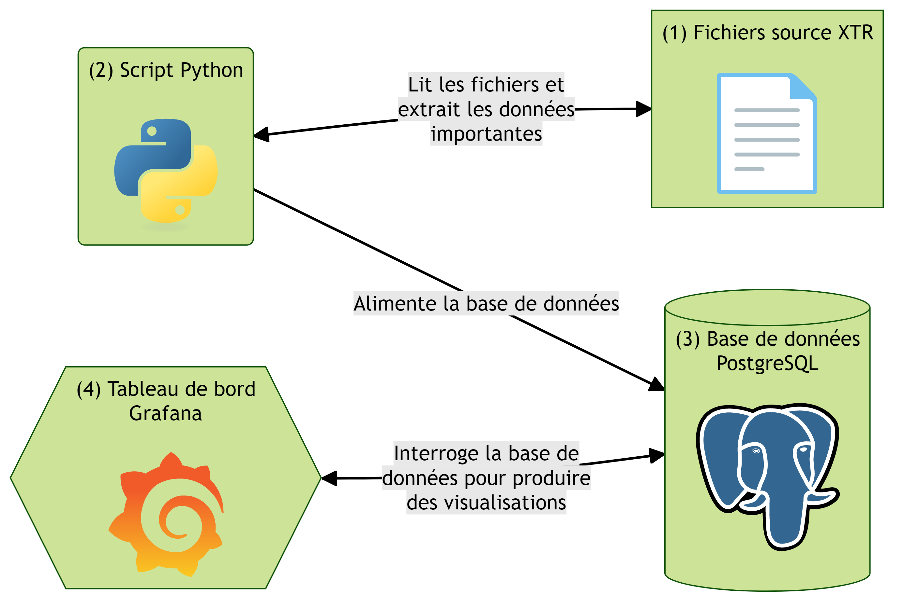

# RENAG quality check

Ce dépôt contient les sources du tableau de bord interactif présentant les données de qualité du réseau RENAG.

Il a été réalisé par [Raphaël Caldwell](raphael.caldwell@etu.univ-cotedazur.fr) dans le cadre de son stage de deuxième année de BUT Informatique.

Ce tableau de bord est disponible en ligne à l'adresse suivante : http://gnssfr.unice.fr/quality-check/

## Vue d'ensemble

Les fichiers de qualité xtr (1) sont produits par le logiciel [Anubis](https://gnutsoftware.com/software/anubis). Ils sont ensuite lus par un script Python, [xtr2database](xtr2database/) (2) qui va insérer les données de qualité dans une base de données PostgreSQL (3). Finalement, quand un utilisateur s'y connecte, le tableau de bord Grafana (4) interroge la base de données pour produire les graphiques.

## Deploiement

Pour déployer votre propre instance de Grafana, basez-vous sur [l'exemple de configuration Docker Compose](docker/).

Si vous preferez ne pas utiliser Docker, vous trouverez des instructions [ici](docs/README.md).
