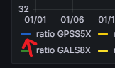
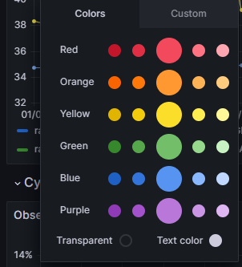
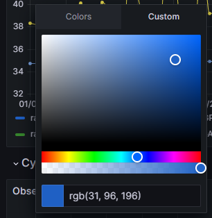

# Documentation RENAG quality check

## Utilisation du *dashboard*

TODO définition du cdc

### Assigner une couleur à une courbe.

L'assignation d'une couleur à une courbe se fait en fonction du nom de la courbe : si une nouvelle courbe est ajoutée, il est nécessaire de lui assigner manuelement une nouvelle couleur.

Cela se fait en créant un *override* sur le *dashboard*. Le moyen le plus simple de faire ça consiste à cliquer sur la couleur de la courbe :



Un menu s'ouvre vous invitant à choisir la couleur de la courbe :



Il est possible de rentrer la couleur qu'on veut :



### Administration

TODO

- Compte admin
- Ajouter des utilisateurs

## Script d'alimentation de la base de données

Pour pouvoir lire et extraire les données pertinentes à l'affichage des graphiques depuis les fichiers XTR et les insérer dans la base de données, un script (xtr2database) est fourni.

### Instalation du script

<!-- TODO : tester les compatibilité de version -->
> **NOTE :** Le script requiert la version 3.x de Python minimum pour fonctionner.

Une fois que vous vous êtes déplacé dans le répertoire [xtr2database](../xtr2database/), suivez les étapes suivantes :

1. #### Création d'un environnement virtuel (optionnel)

    Un [environnement virtuel en Python](https://docs.python.org/3/library/venv.html) est un espace isolé qui permet de gérer facilement les dépendances et les configurations spécifiques d'un projet, offrant ainsi une meilleure portabilité et évitant les conflits entre différentes applications.

    Suivez cette étape si l'installation du script pose un souci de compatibilité de dépendances. Sachez qu'il sera nécessaire d'activer (une seule fois) l'environnement virtuel à chaque utilisation du script.

    ```sh
    # Création
    python3 -m venv env

    # Activation
    source env/bin/activate
    ```

2. #### Installation du script

    ```sh
    python3 -m pip install -U .
    ```

Vous pouvez maintenant utiliser le script ! Testez qu'il soit bien installé avec la commande suivante :

```sh
python3 -m xtr2database --help
```

### Utilisation

Une utilisation basique du script s'effectue de la manière suivante :

```sh
python3 -m xtr2database <chemin/vers/repertoire> <nom du réseau>
```

Le script va se connecter à la base de données, lire les fichiers xtr dans le répertoire précisé et sauvegarder les données comme faisant partie du réseau donné.

Par défaut, les données vont être insérées en mode strict : avant de commencer l'insertion, le script va interroger la base de données et récupérer la liste des fichiers dont le contenu a déjà été inséré dedans. Ainsi, le script va traiter uniquement les fichiers qu'il n'a pas déjà traité précédemment.

Comme alternative, il est possible d'utiliser le mode d'insertion par date (en utilisant l'option `--date`). Le script va donc interroger la base de données et insérer uniquement les fichiers produit après cette date.

Il peut arriver que la base de données se retrouve dans un état inconsistant. Cela signifie que les données ne sont pas présentes en quantités égales entre les métriques (par exemple, il y a plus de données sur le Satellite CS que sur le Multipath, ce qui ne devrait pas arriver). Par défaut dans cette situation-là, le script va refuser d'insérer de nouvelles données.

Par contre, il est possible de forcer l'insertion des données malgré ces inconsistance. Dans ce cas, il est possible d'utiliser l'option `--force` pour tout insérer en partant de zéro. Par exemple, pour insérer de nouvelles données en mode date en forçant l'insertion s'il y a un souci d'inconsistance :

```sh
python3 -m xtr2database <chemin> <réseau> --date --force
```

Finalement, pour écraser dans tous les cas les données précédentes, il est possible d'utiliser l'option `--override`. Cette option est mutuellement exclusive avec l'option `--date`.

## Sauvegarde et restauration des données

TODO

- scripts *wrapper* `pg_dump` & `pg_restore`
- 2 bases de données... (bref car section config bdd)

## Déployement sur une nouvelle machine

### Pré-requis

Avant d'installer et de configurer le *dashboard* sur une machine, il est nécéssaire d'avoir à disposition une base de données [PostgreSQL](https://www.postgresql.org/).

Pour l'installation, referez-vous aux instructions adaptés à votre système : https://www.postgresql.org/download/.

Une version récente (15+) est conseillé, même si cela devrait fonctionner avec des versions plus anciennes de PostgreSQL.

### Configuration de la base de données

Une fois que la base de donnée est accesible, ...

1. Importer le schéma

2. Créer l'utilisateur pour grafana (uniquement select)

### Installation de Grafana

Installez la version 9.5 de Grafana : https://grafana.com/grafana/download?platform=linux&edition=oss.

### Configuration de Grafana

TODO documenter le fichier de config (voir le docker-compose)

### Plugins

- nline-plotlyjs-panel
- marcusolsson-dynamictext-panel

### Connexion à la base de donnée

TODO grafana <-> bdd avec bon utilisateur

### Importation des dashboards

TODO comment importer les dashboards
