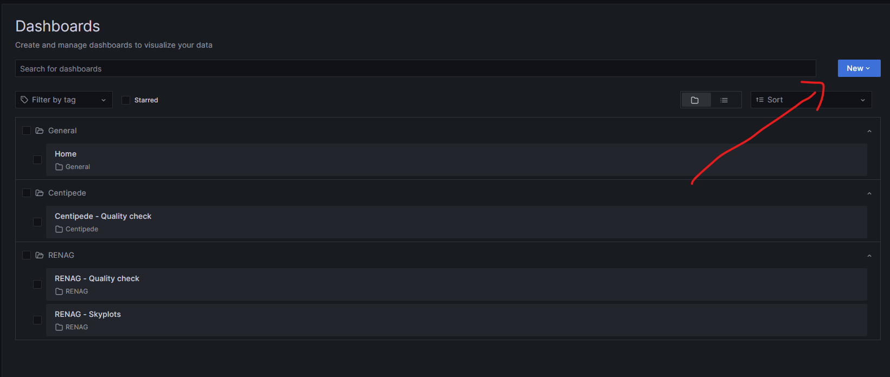

# Documentation RENAG quality check

Quelques intructions axées sur les besoins du laboratoire Géoazur pour l'utilisation et la configuration de leur [instance de Grafana](http://gnssfr.unice.fr/quality-check/).

### Assigner une couleur à une courbe.

L'assignation d'une couleur à une courbe se fait en fonction du nom de la courbe : si une nouvelle courbe est ajoutée, il est nécessaire de lui assigner manuelement une nouvelle couleur.

Cela se fait en créant un *override* sur le *dashboard*. Le moyen le plus simple de faire ça consiste à cliquer sur la couleur de la courbe :


Un menu s'ouvre vous invitant à choisir la couleur de la courbe :


Il est possible de rentrer la couleur qu'on veut :


## Ajout d'un nouveau réseau

Pour ajouter un nouveau réseau, allez sur la plage des tableaux de bord. De la, créez un nouveau dossier :



Ensuite, aller dans la page d'importation d'un nouveau tableau de bord :


De la, pour chaque fichier de tableau de bord présent [ici](../grafana/), glissez-déposez le dans la zone prévue à cet effet puis remplissez les informations suivantes :


1. Donnez un nom unique au tableau
2. Vérifiez qu'il soit dans le bon dossier
3. Donnez lui un identifiant unique
4. Séléctionnez la bonne source de données PostgreSQL
5. Nommez la variable `network` avec le nom du réseau utilisé lors de l'importation avec le script

Vous pouvez ensuite faire les ajustements necéssaires.

## Script d'alimentation de la base de données

Pour pouvoir lire et extraire les données pertinentes à l'affichage des graphiques depuis les fichiers XTR et les insérer dans la base de données, un script (xtr2database) est fourni.

### Instalation et utilisation du script

Voir [ici](../xtr2database/README.md)

## Déployement sur une nouvelle machine

### Pré-requis

Avant d'installer et de configurer le *dashboard* sur une machine, il est nécéssaire d'avoir à disposition une base de données [PostgreSQL](https://www.postgresql.org/).

Pour l'installation, referez-vous aux instructions adaptés à votre système : https://www.postgresql.org/download/.

Une version récente (15+) est conseillé, même si cela devrait fonctionner avec des versions plus anciennes de PostgreSQL.

### Configuration de la base de données

#### Création des bases de données

Une fois que la base de donnée est accesible, il est nécéssaire de créer deux bases de données :

- Une pour Grafana
- Une pour les données à afficher

```sql
create database grafana;
create database quality_check_data;
```

#### Importation du schéma

Pour que le script puisse fonctionner, il est nécéssaire d'importer le [schéma](../database/schema.sql) :

```sh
psql -d quality_check_data -f schema.sql
```

Ensuite, insérer des données universelles :

```sh
psql -d quality_check_data -f inserts.sql
```

Et finalement, créer les indexes. Sachez cependant qu'il est recommandé de les créer une fois que le plus gros des données ont été insérées :

```sh
psql -d quality_check_data -f create_indexes.sql
```

### Ajustement des permissions

Une fois que le schéma a été importé et que toutes les tables ont été crées dans la base de données `quality_check_data`, il est nécéssaire d'ajuster les permissions. En effet, Grafana ne filtre pas les requêtes envoyées à la base de données, il faut donc créer un utilisateur avec un minimum de permissions.

Une fois connecté à la bonne base de données :

```sql
revoke all on schema public from public;

create user grafana_reader with password 'grafana';

grant connect on database quality_check_data to grafana_reader;
grant usage on schema public to grafana_reader;
grant select on all tables in schema public to grafana_reader;
```

### Installation de Grafana

Installez la version **9.5** de Grafana : https://grafana.com/grafana/download?platform=linux&edition=oss.

### Configuration de Grafana

Une fois que Grafana a été installé, il est nécéssaire de configurer. Pour cela, localisez le [fichier de configuration à utiliser en fonction de votre système](https://grafana.com/docs/grafana/latest/setup-grafana/configure-grafana/#configuration-file-location), puis modifiez les valeurs suivantes :

#### Section `server`

- `enable_gzip` = true

#### Section `database`

- `type` = postgres (ou "mysql" ou "sqlite3")
- `host` = \<adresse\>:\<port\>
- `name` = grafana
- `user` = \<utilisateur\>
- `password` = \<mdp\>

#### Section `auth.anonymous`

- `enabled` = true
- `org_name` = Géoazur


Il peut être nécéssaire de configurer d'avantage Grafana en fonction de la configuration du serveur (par exemple si Grafana est exposé directement ou si un proxy inverse est utilisé). Pour cela, référez-vous à la documentation officielle : https://grafana.com/docs/grafana/latest/setup-grafana/configure-grafana/.

### Plugins

Nos visualisations requierent les plugins suivants :

- nline-plotlyjs-panel
- marcusolsson-dynamictext-panel

[Guide sur l'installation des plugins](https://grafana.com/docs/grafana/latest/administration/plugin-management/#install-a-plugin).

### Connexion à la base de donnée

Une fois que la base de données est prête et que Grafana a été correctement configuré et installé, il faut définir notre base de données comme source de données pour Grafana.

Référez-vous à la documentation officielle de Grafana : https://grafana.com/docs/grafana/latest/datasources/postgres/#postgresql-settings.
