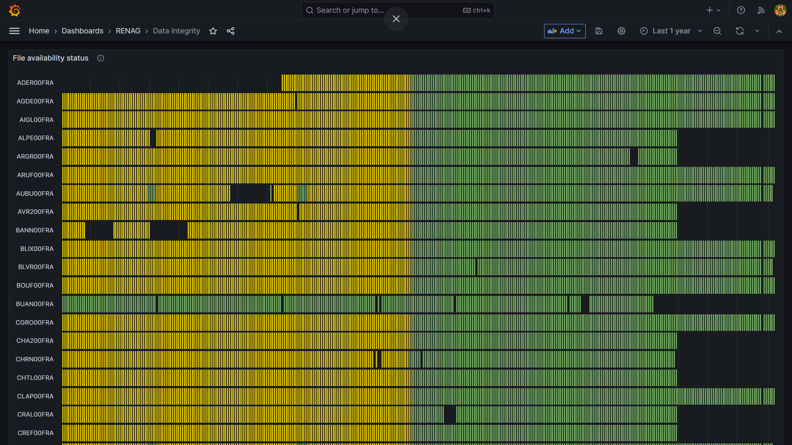

# Fichiers d'importations des tableau de bord Grafana TODO

Ce répertoire contient les fichiers nécessaires pour importer les trois tableaux de bords Grafana qui permettent la visualisation de données. Voir [ici](../docs/#ajout-dun-nouveau-réseau) pour des instructions sur comment les importer.

## Séries temporelles (Quality check)

Ce tableau de bord propose un apperçu de la qualité des données des stations sur plusieurs jours, sous la forme de séries temporelles.

La version intéractive est disponible ici (réseau RENAG) : http://gnssfr.unice.fr/quality-check/d/mXHW63P4k/quality-check?orgId=1

## Skyplots

Ce tableau de bord propose un apperçu detaillé de la qualité des stations sous la forme de *skyplots*.

La version intéractive est disponible ici (réseau RENAG) : http://gnssfr.unice.fr/quality-check/d/d142a90b-c21f-4706-8284-3fb57a442aa3/skyplots?orgId=1

## Disponibilité des fichiers sources (Data integrity)

Ce tableau de bord indique la disponibilité des fichiers de données utilisés pour produire les visualisations précedentes.

La version intéractive est disponible ici (réseau RENAG) : http://gnssfr.unice.fr/quality-check/d/b0dd94a7-e766-4ae2-b824-dc889e06e0b8/data-integrity?orgId=1

Note : Une version adaptée pour les réseau avec beaucoup de stations est disponible.
